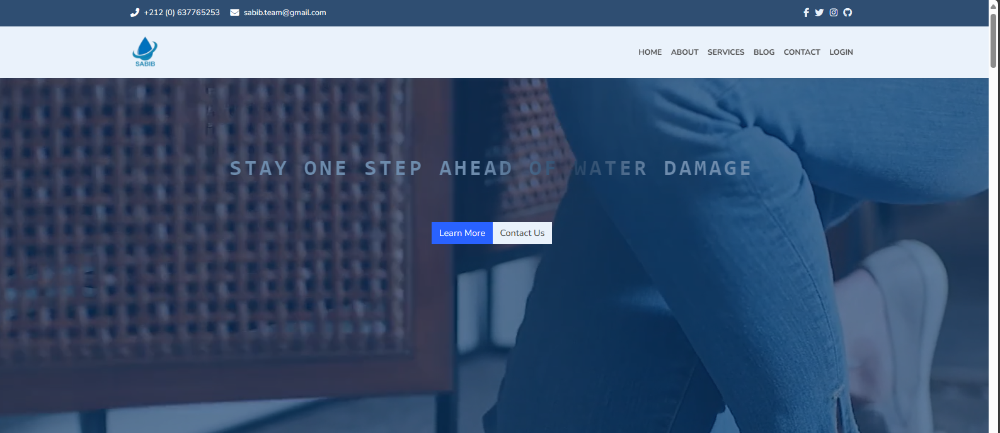

# SABIB
## Save Today, Secure Tomorrow

### Overview 
The Sabib Water Flow Measurement System is a revolutionary project aimed at addressing water scarcity challenges through innovative technology. This system utilizes advanced sensors and a centralized database to provide real-time monitoring of water usage, empowering users to manage their consumption efficiently. Additionally, it incorporates features such as remote water shut-off to mitigate wastage and promote conservation efforts.

### Demo https://sabib.team/

### Installation 
- Hardware Setup: Install the sensors along the main water pipeline according to the provided instructions. Connect the sensors to the centralized database unit.

- Software Setup: Access the web application through a compatible web browser. Follow the on-screen instructions to log in and connect to the centralized database.

### Usage 
- Monitoring Water Usage: Log in to the web application to view real-time data on water consumption, flow rate, and other relevant metrics.

- Setting Alerts: Customize alert settings within the web application to receive notifications about unusual water usage or potential leaks.

- Remote Control: Utilize the web application to remotely activate or deactivate the water shut-off device, providing convenient control over water supply.

### Technologies

#### Design 
- Figma is an excellent tool for designing user interfaces and creating prototypes. [design link](https://www.figma.com/design/fY457IQ5zDLcJEGPKG2d0F/Sabib?node-id=0%3A1&t=EFgJ3JbrysYRHq0j-1)

#### Front-End
- React: A popular JavaScript library for building user interfaces.
- Heroicons: A set of icons for use in web projects.
- Bootstrap Icons: Provides a library of icons for use with Bootstrap.
- Material-UI: A React UI framework that implements Google's Material Design.
- React ApexCharts: A React wrapper for ApexCharts, which is used for interactive charts and graphs.
- React Input Slider: A customizable slider component for React.
- Sass: A preprocessor scripting language that is interpreted or compiled into Cascading Style Sheets (CSS).
- Font Awesome: A library of icons and fonts.

#### Back-End
- Clerk React: Provides authentication and user management functionalities.
- Firebase: Provides backend services such as authentication, real-time database, and hosting.
- ThingSpeak: IoT platform for collecting and storing data from the Sabib Water Flow Measurement System's sensors.

#### Version Control and Collaboration

- Git: Disributed Version Control System.
- GitHub: Web-based platform for Version Control and Collaboration 

#### Cloud Services And Deployement
- Namecheap: Domain registration and Management.
- Vercel:  Vercel offers Deployment Protection to secure your project's preview and production URLs with fine-grained access control.

### Screenshot

### Presntation Slides 
[Presenataion slides](https://www.canva.com/design/DAGFL0778F0/cFZHv6uFMbV1Vi1jdZmztQ/edit?utm_content=DAGFL0778F0&utm_campaign=designshare&utm_medium=link2&utm_source=sharebutton)

### Contributing:

We welcome contributions from developers, engineers, and enthusiasts interested in advancing water conservation technologies.

### Author
- [Saad AIDDI](https://github.com/saad484)
- [LinkedIn](https://linkedin.com/in/saad-aiddi)
- [Gmail](mailto:sabib.team@gmail.com)
